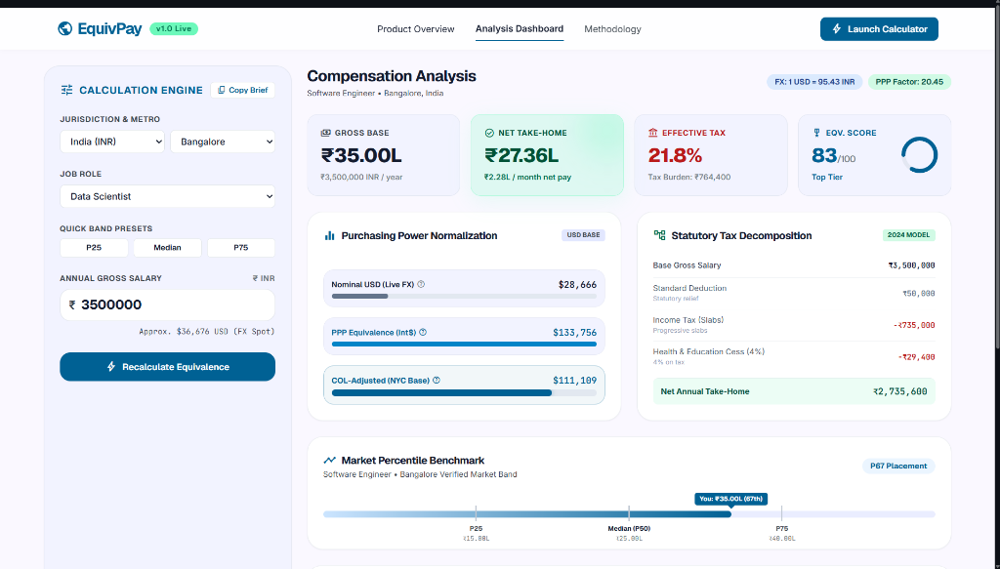

Compensation Equivalence Engine 🌍
A progressive algorithmic pipeline that normalizes global technical compensation using statutory tax models, purchasing power parity (PPP), and dynamic market benchmarking.

Live Dashboard: https://comp-engine.streamlit.app
Live API Docs: https://compensation-equivalence.onrender.com/docs

💡 The Problem
Directly comparing international compensation packages using nominal foreign exchange (FX) rates is fundamentally flawed. A $130,000 salary in San Francisco does not provide the same standard of living as €75,000 in Berlin or ₹2,500,000 in Bangalore due to differing statutory tax brackets, mandatory social contributions, and local purchasing power variations.

This engine solves this problem by executing a multi-tier data pipeline that calculates statutory take-home pay, normalizes for purchasing power parity (PPP) and cost of living (COL), and benchmarks the result against local tech compensation percentiles.

✨ Core Features
Statutory Progressive Taxation: Built-in 2024 tax bracket modeling (Federal, State/Prefecture, Local, and Social Security) for India, the US, Germany, and Japan.

Three-Tier Wealth Normalization:

Nominal USD: Live FX market conversions.

PPP Int$: World Bank Purchasing Power Parity scaling.

COL-Adjusted: Numbeo Cost of Living city indexing anchored to NYC.

Multi-Role Market Benchmarking: Dynamically scores salaries against verified compensation bands for Software Engineers, Data Scientists, and Data Analysts.

Data Staleness Guard: CI/CD pipeline automatically monitors and alerts the UI if reference FX/PPP snapshots exceed a 30-day freshness threshold.

⚙️ Architecture & Data Flow
The engine orchestrates data through a strict 4-stage calculation pipeline:

Ingestion: Validates gross salary, country, city, and job role.

Tax Engine: Processes deductions via local statutory tax models to output Net Take-Home Pay.

Normalization: Applies FX rates, World Bank PPP, and City COL factors to output comparable USD Metrics.

Benchmarking: Executes linear interpolation against role market percentiles to output a final 0-100 Equivalence Score.

💻 Developer API
The backend is fully deployed as a scalable web service. The API returns a comprehensive JSON payload containing the statutory tax breakdown, all normalized conversion vectors, and the final market benchmark score.

⚙️ Technical Stack & Infrastructure :
Language & Core: Python 3.11, Pandas, Pydantic

Backend API: FastAPI, Uvicorn (Deployed on Render)

Frontend UI: Streamlit (Deployed on Streamlit Community Cloud)

Quality Assurance & CI/CD: Pytest, GitHub Actions (Automated testing on push)

Data Sources: World Bank Development Indicators (PPP), 2024 Statutory Tax Tables, Numbeo Cost of Living Index
